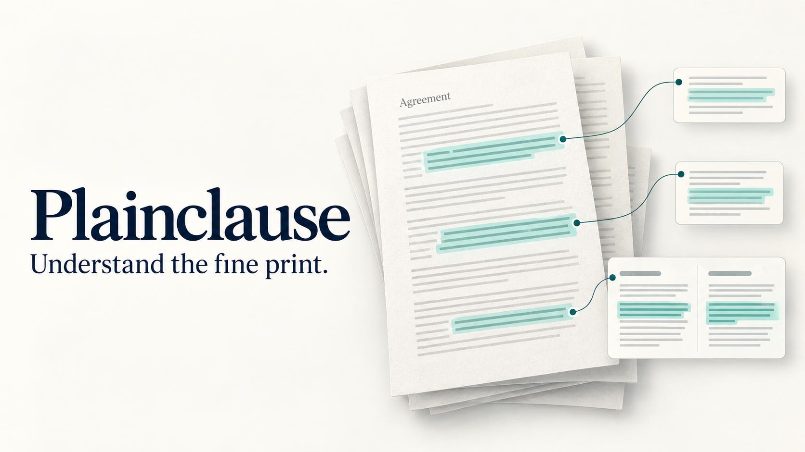
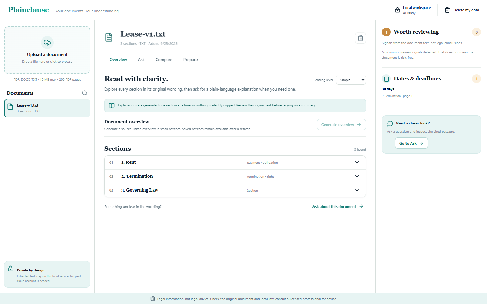
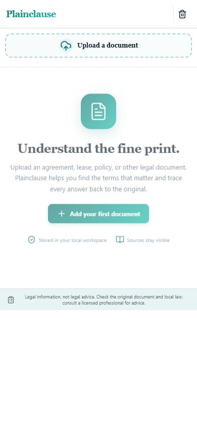
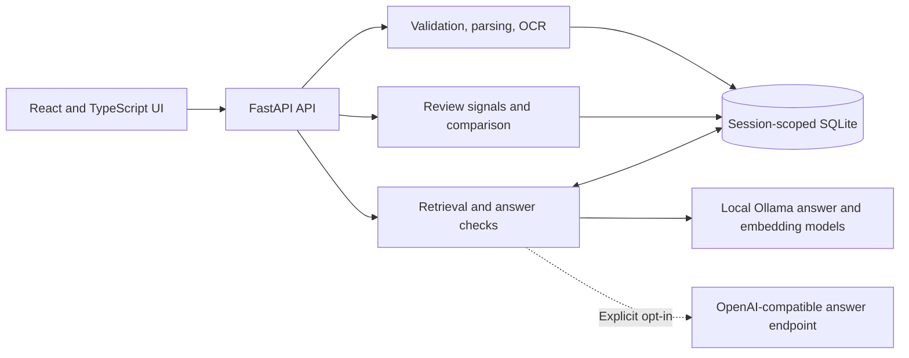
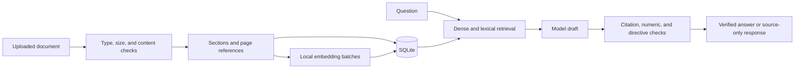

# Plainclause

**Understand the fine print.** [Open the Vercel deployment](https://plainclause-xi.vercel.app/) · [Explore the code](https://github.com/9059Rohith/plainclause) · [Submission report](docs/submission-report-2026-09-25.md) · [Engineering review](docs/quality-gate.md) · [Deployment details](docs/vercel-deployment.md)

Plainclause is an AI-powered legal document assistant that simplifies, compares, analyzes, and explains legal information while helping users identify key clauses, risks, and next steps. It extracts PDF, DOCX, and UTF-8 TXT files; preserves clause headings and PDF page references; highlights terms worth reviewing; answers questions using passages from the selected document; compares clause wording across documents; and prepares a checklist and questions for a lawyer. It provides **legal information, not legal advice**.

**Read this first:** [Feature evidence](docs/feature-evidence.md) · [Security review](docs/security-review.md) · [Code quality](docs/code-quality-report.md) · [Test report](docs/test-report-2026-09-25.md) · [Latency measurements](docs/latency-report-2026-09-25.md) · [Accessibility review](docs/accessibility-review.md) · [Submission readiness](docs/submission-readiness.md).

**Jump to:** [Features](#features) · [Run locally](#run-locally) · [Architecture](#architecture) · [Configuration and API](#configuration-and-api) · [Tests](#tests-and-checks) · [Security](#privacy-and-security) · [Limits](#limits-and-troubleshooting).

### Submission status

The [Vercel deployment](https://plainclause-xi.vercel.app/) serves the frontend and proxies `/api` to the local FastAPI/Ollama service over an ngrok tunnel. A public synthetic upload, index, cited answer, and deletion passed on 2026-09-25. The link depends on this computer and tunnel for document features; it is **not a durable cloud backend**. The repository is ready for a local technical review, while the [readiness matrix](docs/submission-readiness.md) records the remaining durable-hosting and independent-review gates. An external evaluation score or a 100% submission result cannot be inferred from repository checks.

## Features

- **Document Upload & Parsing** — PDF, DOCX, and TXT with structure-preserving extraction, clause boundaries, page references, and OCR for scanned PDFs
- **Plain-Language Explanations** — Simple and detailed reading levels for every section, with on-demand full-document overview
- **Source-Grounded Q&A** — Ask questions and get answers backed by cited passages from your document, with streaming progress
- **Smart Review Signals** — Automatic detection of clauses worth reviewing: auto-renewals, indemnification, liability caps, penalties, and more
- **Document Comparison** — Side-by-side clause comparison across 2–5 documents with highlighted money/period changes
- **Lawyer Preparation Sheet** — Source-linked checklist, questions, and talking points exportable as Markdown or PDF
- **Privacy-First Architecture** — Local processing by default with an explicit cloud provider opt-in; session-scoped SQLite storage with secure-delete
- **Hallucination Guardrails** — Citation-ID checks, numeric-claim verification, directive filtering, and source-only fallback

## At a glance

Plainclause is designed for readers who need to understand practical obligations before discussing a document with a lawyer. The interface has **Overview**, **Ask**, **Compare**, and **Prepare** views. The original passage remains visible beside interpretations, and the app identifies sections a generated overview has not cited. Review signals are prompts to inspect wording, not legal verdicts.

| Layer | Implementation | Role |
| --- | --- | --- |
| Interface | React 19, TypeScript 5.7, Vite 6 | Document workspace, explanations, comparison, and exports |
| API | FastAPI, Pydantic | Upload validation, session boundaries, workflow endpoints |
| Parsing | pypdf, PyMuPDF, python-docx, RapidOCR | Structured text and scanned-page OCR |
| Retrieval | scikit-learn, Ollama `all-minilm` | Persisted embeddings plus term matching |
| Answers | Ollama `qwen2.5:1.5b` | Local drafts checked against cited passages |
| Storage | SQLite | Session-scoped sections, vectors, history, and summaries |
| Delivery | Vercel static frontend, ngrok API proxy; Docker/Railway configuration | Public evaluation link and separate durable-hosting path |

### Feature verification matrix

| Capability | User-visible result | Evidence | Status |
| --- | --- | --- | --- |
| Upload and validation | Extracted sections from PDF, DOCX, or TXT; clear error for invalid content | Parser and API tests | Passed locally |
| Scanned PDF OCR | Locally transcribed pages labeled for verification | Image-only PDF test | Passed locally, scan quality varies |
| Section and page references | Headings, full clause text, and PDF page numbers visible | Parser boundary tests | Passed locally |
| Explanations and overview | Simple/detailed section text; saved, resumable overview batches | Summary API and browser tests | Passed locally |
| Hybrid document Q&A | Cited answer or source-only fallback; saved history | Retrieval, grounding, streaming, browser tests | Passed locally |
| Review and deadlines | Source-linked signals and date/period expressions | Analysis tests | Passed locally, heuristic |
| Comparison | Added/removed/modified clauses and amount/period changes across 2–5 documents | Comparison and browser tests | Passed locally |
| Preparation and export | Questions, checklist, goals, Markdown, and browser PDF/print | Browser workflow tests Markdown; print control inspected in source | Passed locally for preparation and Markdown; PDF output unverified |
| Session privacy and deletion | Cookie-scoped documents and cascading deletion | API isolation/deletion tests | Passed locally |
| Vercel evaluation deployment | Public frontend, upload, index, cited answer, and deletion | [Public smoke test](docs/vercel-deployment.md) | Passed at recorded check; backend depends on local tunnel |
| Durable Railway hosting | Public service with `/data` persistence and model readiness | Remote build and smoke test required | **Blocked by Railway account restriction** |

The detailed [implementation-to-test map](docs/feature-evidence.md) records code locations and boundaries for each row.

### Product screenshots

These are browser captures from automated workflows. The desktop view uses a synthetic lease; the mobile view is the real empty workspace. No customer document is shown.

| Desktop document workspace | Mobile starting view |
| --- | --- |
|  |  |

[See the cited answer captured from the live Vercel URL](docs/assets/plainclause-vercel-live.png).

## Run locally

Requirements: Python 3.12 on Windows for the verified lockfile, Node.js 20+, and [Ollama](https://ollama.com/) for AI explanations. No account, API key, credit card, or paid service is required.

```powershell
git clone https://github.com/9059Rohith/plainclause.git
cd plainclause
python -m venv .venv
.venv\Scripts\Activate.ps1
python -m pip install -r backend/requirements.lock.txt
npm ci
ollama pull qwen2.5:1.5b
ollama pull all-minilm
npm run build
python -m uvicorn app.main:app --app-dir backend --host 127.0.0.1 --port 8000
```

Open <http://127.0.0.1:8000>. For frontend development, run `npm run dev` in another terminal and open <http://127.0.0.1:5173>; Vite proxies `/api` to port 8000. The backend serves the built UI from `dist` if present. Ollama must be running locally for generated explanations and semantic retrieval; precise-word retrieval and deterministic review/compare/prep still work if it is unavailable. `PLAINCLAUSE_MODEL` defaults to `qwen2.5:1.5b`, `PLAINCLAUSE_EMBED_MODEL` to `all-minilm`, and `PLAINCLAUSE_OLLAMA_URL` to `http://127.0.0.1:11434`. Model requests are restricted to loopback URLs.
If port 8000 is occupied, use `--port 8765` in the backend command and open <http://127.0.0.1:8765>.
`PLAINCLAUSE_DB_PATH` can point to a different local SQLite file; browser tests use an isolated file under `test-results`. `backend/requirements.lock.txt` records the 56-package Windows/Python 3.12 environment verified for this build; `backend/requirements.txt` lists supported package ranges for other setups.

Ollama is the default answer provider. To opt into cloud answers, set `PLAINCLAUSE_PROVIDER=openai` and `OPENAI_API_KEY` before starting the backend. In that mode, retrieved document excerpts and questions are sent to the configured OpenAI endpoint; the local-only privacy statements below apply only with the default Ollama provider. Embeddings remain local. The UI status reports provider availability, not the provider name.

## Vercel evaluation deployment

**Live URL:** <https://plainclause-xi.vercel.app/>. The Vercel deployment was `READY`, and the public URL completed a synthetic upload, semantic index, source-cited Q&A, and deletion on 2026-09-25. The frontend is hosted by Vercel; `/api` is proxied to the local FastAPI/Ollama backend through ngrok. See the [deployment report](docs/vercel-deployment.md) for the deployment ID, smoke-test result, and operational limits.

This URL is available for evaluation while this computer, the backend, Ollama, and the tunnel remain online. Vercel does not host the model or SQLite database. The backend stores extracted document data in an isolated local preview database. Do not upload confidential documents to this public evaluation service.

### Direct tunnel preview

**Direct preview URL:** <https://bee-nonintersecting-overwarily.ngrok-free.dev/>. It may show ngrok's first-visit warning. The Vercel URL above is the preferred evaluation entry point.

An optional `PLAINCLAUSE_ACCESS_PASSWORD` environment variable enables a Basic-auth password gate across the UI and API (username `plainclause`). The evaluation preview leaves this variable unset so evaluators can open the link directly; anyone who obtains the URL can therefore access the service. Set `PLAINCLAUSE_HOSTED_PREVIEW=1` to show the in-app tunnel/privacy notice and use Secure session cookies. The current preview runs the same backend and local Ollama model on this computer through an ngrok HTTPS tunnel; its URL changes or expires, and it only works while the computer, backend, and tunnel stay running. This is a test preview, not durable cloud hosting. Uploaded document traffic passes through ngrok before reaching this computer. Preview data uses an isolated SQLite database under `.runtime/`; `.runtime/` is ignored by Git. Delete your workspace data after testing. Do not treat a free tunnel as a production deployment or upload documents you cannot share with its tunnel provider. Ngrok may show first-time visitors a one-time safety page before the application.

## Railway deployment

The repository includes a Docker image and Railway configuration for a single service containing the frontend, FastAPI, and local Ollama models. The image sets `PLAINCLAUSE_HOSTED_SERVICE=1`; the app then describes hosted processing and storage accurately. The database path is `/data/plainclause.db`, so a persistent Railway volume must be mounted at `/data` before use. Railway checks `/api/ready` and only routes traffic when the model is available. See [Railway deployment steps and current status](docs/railway-deployment.md).

This deployment is **not live** as of 2026-09-25. The new Railway account has a `plainclause` project, a `/data` volume, and a reserved domain. Railway rejected both code uploads with `Your workspace has been restricted. Please attach a payment method or contact support to resolve this.` The repository cannot be connected directly because that Railway account does not have access to the GitHub repository. No container image has been built or verified remotely; the Docker Desktop engine is unavailable locally. The reserved Railway domain is not evidence of a working app. See the [deployment runbook](docs/railway-deployment.md) for the exact status.

### Docker deployment recipe

For a machine with a working Docker engine, the repository's single image can be built and run with persistent SQLite storage:

```sh
docker build -t plainclause .
docker volume create plainclause-data
docker run --rm --name plainclause -p 8000:8000 -v plainclause-data:/data plainclause
```

The image serves the built UI and API on port 8000 when `PORT` is unset, starts its bundled Ollama models locally, and keeps the database on the named volume. Check `http://127.0.0.1:8000/api/ready` before uploading anything. This exact container recipe is documented from the Dockerfile and entrypoint but has **not been executed on this machine** because Docker Desktop is unavailable. The first image build downloads Ollama and both models and may be slow and large. Railway uses the same Dockerfile, `railway.json`, and a `/data` volume.

## How it works

The FastAPI backend validates and extracts document text in memory. It stores extracted sections, local embeddings, saved summaries, Q&A history, and source-ID-only audit events in `backend/data/plainclause.db` (SQLite); original binary uploads are discarded. Numbered headings, numbered operative clauses, uppercase headings, and PDF page references form bounded sections; the full wording of a numbered sentence stays in its cited passage. Image-only PDF pages are transcribed with local RapidOCR ONNX models, and each OCR-derived section carries a verification notice. OCR is limited to 50 pages per file; unreadable pages are rejected instead of silently skipped. Clause categories, review signals, and date/period extraction use transparent text rules. These are prompts to review, not risk verdicts or legal conclusions.

After upload, the UI indexes sections in batches of 16 with the local `all-minilm` model and shows the actual indexed count. Vectors persist in SQLite and are reused. Question answering combines cosine similarity and TF-IDF term overlap to retrieve up to five sections from the selected document. If embeddings are unavailable, it falls back to precise-word retrieval. Retrieved sections, as untrusted data, are sent only to the local Ollama model with a separate system instruction. Obvious prompt-injection lines are removed from model context. A generated answer is accepted only if it names supplied passage IDs and does not introduce unsupported amounts/periods or certain definitive legal directives. Otherwise the app shows source passages without an AI interpretation. This is a conservative guardrail, not a formal proof of factual accuracy. Temperature is zero for consistency. Q&A streams status and model-output progress but withholds draft legal prose until the full response passes citation and directive checks. Answers and citations remain in document-specific history across refreshes.

The simple/detailed reading level applies to both section explanations and the document overview. Explanations are requested one section at a time so skipped clauses are visible rather than silently omitted. The on-demand overview processes six sections per model call, reports exact section progress, and can cover the whole document without sending it all in one context. Completed batches and the selected reading level persist across refreshes and can be resumed. It names sections that received no citation. If a batch cannot be verified, it stops and shows source passages; the UI marks remaining sections as unprocessed.

Comparison aligns sections by heading and reports added, removed, or modified text, highlighting exact money-amount and time-period changes. It does not determine legal materiality. The preparation sheet gathers rule-detected review signals and time expressions into source-linked questions, lets the user add goals and context, then offers Markdown and browser print/PDF export. Q&A and section explanations also export to Markdown.

The preparation sheet includes exact key passages and general types of local legal or community help where the document suggests a rental or employment context; it makes no claim that any particular service exists in the user's location.

Verified answers to exact repeated questions are reused from document-scoped history, avoiding another model call. Source-only and not-found responses are regenerated so a newly available model can still help.

## Privacy and security

The server binds to `127.0.0.1` in the documented local command; the Railway container binds to its assigned service port. A random 256-bit, HttpOnly, SameSite cookie scopes every document operation. The browser sends a custom request header on mutations, and the backend blocks cross-origin/cross-site requests. Session-scoped request caps bound uploads, indexing, and model calls. Document content is not logged; audit events contain only operation names, source IDs, and result status. With the default local setup, document content stays on the user's computer. A hosted evaluation deploy stores extracted content on the cloud provider's volume, and the temporary preview routes uploads through its tunnel provider. The Ollama model URL is restricted to numeric loopback addresses. The app applies a 10 MB upload limit, a 200-page PDF limit, a 50-page OCR limit, text and DOCX expansion limits, extension/MIME/content checks, active-PDF-content rejection, safe errors, and restrictive response headers. Delete my data removes all current-workspace rows, including sections, embeddings, summaries, Q&A history, audit events, and rate-limit counters, and clears saved prep goals in the current browser tab. SQLite secure-delete is enabled to overwrite deleted rows; disk snapshots and backups may retain older copies. If you clear the browser cookie without deleting, the old workspace becomes inaccessible; for sensitive use, delete data before clearing cookies. This is a single-user tool with session isolation, not a multi-user hosted authentication system.

| Control | Present behavior | Practical limit |
| --- | --- | --- |
| Session isolation | Random cookie and session-scoped database queries | No account recovery or public-user identity |
| Browser request checks | Custom mutation header, origin checks, restrictive response headers | Does not replace network-wide abuse controls |
| Upload validation | Type/signature checks, active-content rejection, expansion and page limits | Malformed or unusual files still need inspection |
| Model grounding | Citation-ID and numeric checks, directive filter, source-only fallback | Does not prove every interpretation correct |
| Data deletion | Cascading SQLite deletion and `secure_delete` | Backups, snapshots, and external providers may retain copies |
| Optional preview password | Basic auth when configured | Not enabled on the public evaluation tunnel |

The [security review](docs/security-review.md) maps each control to tests and lists residual risks. Dependency advisory results are in the [code quality report](docs/code-quality-report.md).

## Legal-information policy

Generated interpretations carry a visible disclaimer and source excerpts. The app declines questions without retrieved evidence, cautions that legal meaning varies by jurisdiction, and highlights questions mentioning criminal exposure, litigation, immigration deadlines, eviction, foreclosure, bankruptcy, or clearly large financial amounts for prompt professional help. It does not verify statutes or case law. A licensed attorney can assess the full document and your circumstances.

## Tests and checks

See the [current submission report](docs/submission-report-2026-09-25.md), [README quality audit](docs/readme-quality-audit.md), [engineering and design review](docs/quality-gate.md), and [evaluation snapshot](docs/evaluation-2026-09-16.md) for verification evidence and known limits.
On the documented Windows setup, `scripts/verify.ps1` runs the core checks in sequence.

```powershell
$env:PYTHONPATH='backend'; python -m pytest backend/tests -q
npm run typecheck
npm run lint
npm run build
npm run test:e2e
npm audit --audit-level=high
python -m pip_audit -r backend/requirements.lock.txt --no-deps --disable-pip
```

`pip_audit` requires the separate free `pip-audit` package; if it is not installed, run `python -m pip install pip-audit`. Browser tests start a temporary backend on port 8766 and require Google Chrome because the Playwright config uses its installed `chrome` channel. Tests cover parsing boundaries, OCR, a 200-page PDF, lease/NDA/ToS retrieval, classification and deadlines, prompt-injection filtering, grounded retrieval, comparison, session isolation, persisted index/history/summary deletion, streamed answer validation, and invalid uploads.

### Current verification results

| Check | Result on the documented Windows setup |
| --- | --- |
| Backend/API suite after SQLite resource fix | **36 passed**, 2 upstream test-client deprecation warnings |
| Playwright Chrome | **4 passed**: desktop workflow, mobile overflow, preview notice, hosted-service notice |
| TypeScript, ESLint, Vite build | Passed; production frontend bundle created |
| JavaScript advisory scan | `npm audit --audit-level=high`: 0 vulnerabilities reported |
| Python dependency consistency and advisory scan | `pip check`: no broken requirements; `pip-audit`: no known vulnerabilities in pinned environment |

The full [test report](docs/test-report-2026-09-25.md) records the commands, coverage areas, and gaps. Automated tests confirm observed behavior on the tested configuration; no code-coverage percentage or Linux CI result is claimed.

### Measured local latency

The reproducible [latency probe](scripts/measure_latency.py) used an isolated SQLite database, two synthetic three-section TXT files, in-process FastAPI `TestClient`, and the already-running local Ollama model. On the tested Windows machine, the empty document list had **6.0 ms median** and **12.2 ms p95** across 30 calls; two TXT uploads took **35.2** and **35.7 ms**; one uncached local-model answer took **7.2 s**. See the [full latency report](docs/latency-report-2026-09-25.md) for status, document read, preparation, comparison, sample counts, machine details, and limits. These measurements exclude browser and network time and are not a hosted service-level objective.

## Limits and troubleshooting

- English documents are supported. OCR quality varies with scan clarity; verify every name, number, date, and clause against the original scan. PDFs with more than 50 scanned pages need splitting.
- Heading detection and review signals are heuristic. Unusual layouts, tables, or phrasing can be missed. The original text remains visible.
- Semantic search improves synonym matching, but can still retrieve the wrong passage or miss context across distant clauses. Ask precise questions and check all cited text.
- The 1.5B local model can misinterpret legal language. Even cited output needs human review. When Ollama is missing, the app shows sourced text instead of pretending to explain it.
- This repository has automated and live-model checks, but no independent licensed-attorney review of explanations or review signals. It is not validated for professional legal use or public multi-user deployment.
- Long-document overview generation can take many minutes because every six sections require a separate local model call. The app reports and saves batch progress, lets you stop after the current batch, and resumes completed batches after refresh; review any remaining sections individually.
- For a PDF parsing error, verify that the file opens normally, is not encrypted, and has no active content. For model unavailability, run `ollama list`, pull both configured models, and confirm Ollama is running on port 11434.
- The documented local workspace should not be exposed directly to a public network. The ungated evaluation tunnel above is a temporary preview; it has session isolation and basic per-session request caps, but no account authentication or network-wide abuse protection suitable for public production use.

Comparison and preparation UI modules load on demand. Long section lists use browser content-visibility to avoid laying out off-screen rows, and document-list search is debounced.

## Architecture



The user flow is: upload a PDF, DOCX, or TXT file; inspect extracted sections and source pages; optionally index embeddings; request a source-linked explanation or ask a question; compare documents or export a lawyer preparation sheet; delete the workspace data when finished.



`src/` contains the React/Vite interface and export helpers. `backend/app/ingest.py` parses, OCRs, and chunks documents, `analysis.py` produces review signals and comparison rows, `rag.py` retrieves and checks answer grounding, `model.py` talks to local Ollama, `storage.py` owns SQLite, and `main.py` exposes validated API routes. The default local setup runs on the user's computer without billing activation; the Railway image is designed to run those components on hosted infrastructure.

### Component responsibilities

| Component | Responsibility | Main boundary |
| --- | --- | --- |
| `src/App.tsx` | Workspace state, upload, section reading, Q&A, navigation, deletion | Calls the typed browser API client; does not parse legal files itself |
| `src/Compare.tsx`, `src/Prepare.tsx` | On-demand comparison and preparation views | Work from API data; export helpers live in `src/export.ts` |
| `backend/app/main.py` | Input validation, session cookie, request caps, HTTP routes, static UI | Requires the client header on mutations and scopes document IDs to the session |
| `backend/app/ingest.py` | Signature checks, parser bounds, headings, tables, PDF page labels, OCR | Rejects unreadable or active content rather than silently discarding it |
| `backend/app/analysis.py` | Deterministic review signals, dates, section alignment, amount/period diffs | Emits review prompts, not legal judgments |
| `backend/app/rag.py` | Lexical/dense retrieval and answer acceptance checks | Returns cited or source-only text when evidence/model output is insufficient |
| `backend/app/model.py` | Ollama or opt-in OpenAI-compatible calls | Local Ollama URL is restricted to numeric loopback; cloud mode is explicit |
| `backend/app/storage.py` | SQLite transactions, session-scoped reads, deletion, saved vectors/history | Connections close after every transaction |

### Persistence model

| Table | Stored data | Lifetime |
| --- | --- | --- |
| `documents` | Session ID, file name/type, timestamp | Until current session deletes the document/data |
| `chunks` | Ordered section heading, text, PDF page | Cascades with its document |
| `embeddings` | Model-keyed vector per section | Cascades with its section |
| `messages` | Saved question and checked answer | Cascades with its document |
| `summaries` | Overview batch offset and result | Cascades with its document |
| `audit_events` | Operation name, source IDs, result status | Cascades with its document; no document text logged |
| `request_limits` | Per-session operation counters by time bucket | Old buckets are pruned; current session can clear them |

SQLite has foreign-key cascades and `secure_delete=ON`; physical backups and snapshots remain outside the app's deletion scope. The original PDF, DOCX, or TXT binary is not retained after extraction. The [feature evidence](docs/feature-evidence.md) maps these structures to tests.

```text
src/                 React views, API client, exports, and styling
backend/app/         FastAPI, ingestion, analysis, retrieval, models, SQLite
backend/tests/       Backend and API tests
tests/e2e/           Playwright browser workflows
deployment/start.sh  Container startup for Ollama and FastAPI
Dockerfile           Multi-stage frontend and backend image
railway.json         Railway build and readiness configuration
scripts/verify.ps1   Local verification sequence
docs/                Submission, evaluation, deployment, and review reports
```

## Configuration and API

| Variable | Default | Purpose |
| --- | --- | --- |
| `PLAINCLAUSE_DB_PATH` | `backend/data/plainclause.db` | SQLite path; use persistent storage when hosted. |
| `PLAINCLAUSE_MODEL` / `PLAINCLAUSE_EMBED_MODEL` | `qwen2.5:1.5b` / `all-minilm` | Local answer and embedding models. |
| `PLAINCLAUSE_OLLAMA_URL` | `http://127.0.0.1:11434` | Numeric-loopback Ollama endpoint. |
| `PLAINCLAUSE_PROVIDER` | `ollama` | Set to `openai` to opt into cloud answers. |
| `OPENAI_API_KEY` | Unset | Cloud-answer credential; keep out of Git. |
| `PLAINCLAUSE_OPENAI_MODEL` / `PLAINCLAUSE_OPENAI_BASE_URL` | `gpt-4o-mini` / OpenAI API | Optional model and compatible endpoint. |
| `PLAINCLAUSE_ACCESS_PASSWORD` | Unset | Optional Basic-auth gate; username `plainclause`. |
| `PLAINCLAUSE_HOSTED_PREVIEW` / `PLAINCLAUSE_HOSTED_SERVICE` | Unset | Hosted privacy notices and secure-cookie behavior. |

Document operations use a random HttpOnly session cookie. Mutations require `X-Requested-With: Plainclause`; the browser client adds it. The backend disables generated OpenAPI pages. A simple health probe is `curl http://127.0.0.1:8000/api/status`.

| Method | Route | Purpose |
| --- | --- | --- |
| `GET` | `/api/status`, `/api/ready` | Provider status and model readiness |
| `GET`, `POST` | `/api/documents` | List or upload documents |
| `GET`, `DELETE` | `/api/documents/{id}` | Read or delete a document |
| `GET`, `POST` | `/api/documents/{id}/index` | Check or build its semantic index |
| `POST` | `/api/ask`, `/api/ask/stream` | Cited Q&A; the stream is newline-delimited JSON |
| `POST`, `GET`, `DELETE` | `/api/documents/{id}/summary`, `/api/documents/{id}/summaries` | Generate, read, or clear overview batches |
| `POST` | `/api/documents/{id}/simplify`, `/api/compare` | Explain a section or compare documents |
| `GET` | `/api/documents/{id}/prepare`, `/api/documents/{id}/history` | Preparation data and Q&A history |
| `DELETE` | `/api/data` | Delete the current session's stored data |

Uploads use multipart form field `file`. Q&A uses JSON such as `{"document_id":"...","question":"..."}`. See [API implementation](backend/app/main.py) and [browser client](src/api.ts) for request and response details.

### Minimal API walkthrough

Run this after starting the local backend. Replace `your-document.txt` with a supported file containing text you are allowed to process. The session object preserves the cookie, which is required to read the uploaded document again.

```python
from pathlib import Path
import requests

base = "http://127.0.0.1:8000"
headers = {"X-Requested-With": "Plainclause"}
with requests.Session() as session:
    status = session.get(f"{base}/api/status", timeout=15)
    status.raise_for_status()
    print(status.json()["model_available"])

    with Path("your-document.txt").open("rb") as file:
        upload = session.post(
            f"{base}/api/documents",
            files={"file": ("your-document.txt", file, "text/plain")},
            headers=headers,
            timeout=30,
        )
    upload.raise_for_status()
    document_id = upload.json()["id"]

    answer = session.post(
        f"{base}/api/ask",
        json={"document_id": document_id, "question": "What notice period is stated?"},
        headers=headers,
        timeout=180,
    )
    answer.raise_for_status()
    print(answer.json()["status"], answer.json()["citations"])

    deleted = session.delete(f"{base}/api/data", headers=headers, timeout=30)
    deleted.raise_for_status()
```

An answer can have `answered`, `source_only`, or `not_found` status. Check every cited passage in the original document. The streaming variant sends newline-delimited `status`, `progress`, and final `result` events; draft legal prose is withheld until its grounding checks complete. Upload, comparison, index, and generation calls have per-session rate limits, so batch clients should honor `429` responses.

## Next steps and contributing

- [x] Structured extraction, OCR, grounded Q&A, overview, comparison, and preparation workflows.
- [x] Local test suite and temporary public smoke test with synthetic content.
- [ ] Resolve the Railway workspace restriction, build the image, and pass cloud smoke tests.
- [ ] Add account authorization and wider abuse controls before public multi-user use.
- [ ] Seek attorney, accessibility, security, and load reviews before professional use.

Contributions are welcome through GitHub issues and pull requests. Fork the repository, create a focused branch, run `scripts/verify.ps1` on the documented setup, and describe behavior, evidence, and limitations in the PR. Preserve source visibility and the legal-information framing when changing model output. The local latency probe is a small synthetic measurement; no hosted load or scale benchmark is included.

## License

[MIT](LICENSE) © 2026 Plainclause contributors.
